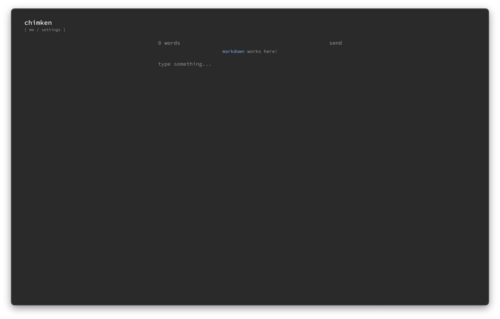
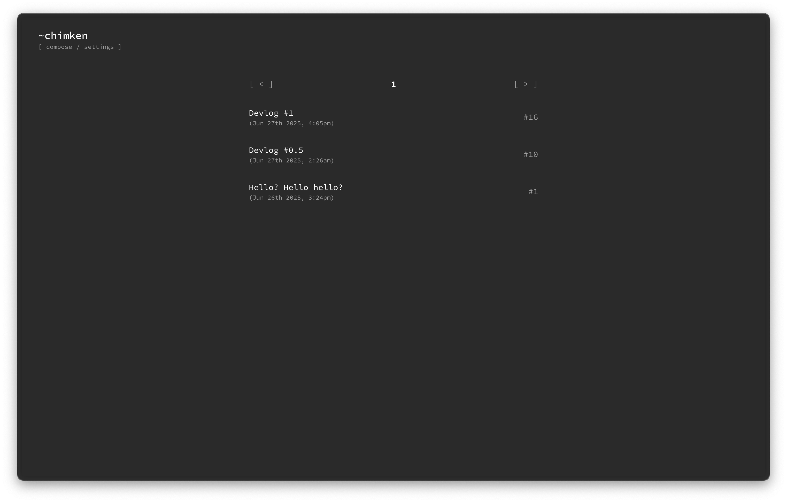
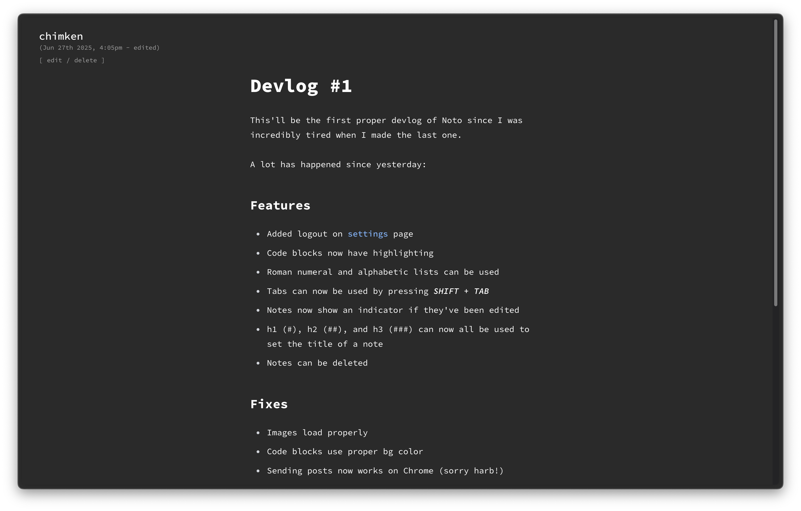
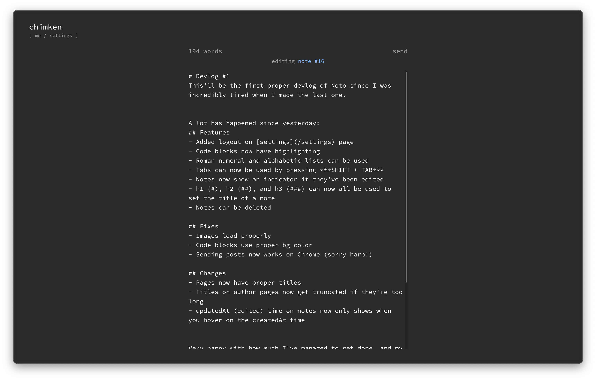

#  noto
a simple blogging site

<br/>

Noto is very much in early development, needing a good security update and a couple missing features before a v1 is warranted.<br/>
However, everything you'd expect from a simple blogging site is here and ready to mess with.

## Screenshots





## Installation
Noto can be installed and run in two ways.<br/>
Either using Docker, or downloading it directly from GitHub and using Bun.

Using Docker is recommended since it makes running and updating this really easy, but each to their own.

### Prerequisites
Before you continue, make sure you have:
- [Docker](https://www.docker.com/) or [Git](https://git-scm.com/)
- [PostgreSQL](https://www.postgresql.org/)

This guide will assume you have at least a basic understanding of these tools, and know how to use a terminal.

### PostgreSQL
[to be written]

### Environment
[to be written]

### Docker
To proceed, make sure you have [Docker](https://www.docker.com/) installed.

If you don't want to use Docker, skip this section.

#### Step 1
Download the latest image:
```console
docker pull netchimken/noto:latest
```

#### Step 2
Run the image:
```console
docker run --name=noto --env-file=<ENV_LOCATION> -p 3000:3000 netchimken/noto
```

- Replace `<ENV_LOCATION>` with the path to your `.env` file.
- To use a local database, add `--add-host=host.docker.internal:host-gateway` as an argument.
- To run in the background, add `-d` as an argument.

#### Extra
To stop the container, run:
```console
docker container stop noto
```

To update the container, run:
```console
docker pull netchimken/noto:latest
```

### Git
To proceed, make sure you have [Git](https://git-scm.com/) installed.

If you're using Docker, skip this section.

[to be written]
